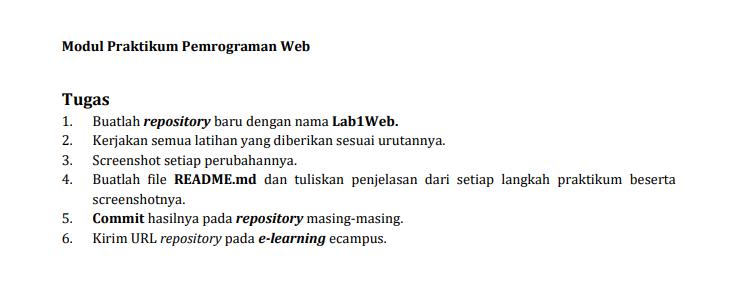

# Lab1web_
Tugas Pertemuan 2 Lab1Web
 
<h1>بِسْمِ اللهِ الرَّحْمٰنِ الرَّحِيْم<h1/>
 
<h2>sandi bintara<h2/>
<h2>312010039<h2/>
<h2>TI20B1<h2/>
 

# Tugas

 

# HTML
> <!DOCTYPE html>
<html>
<head>
<title>Belajar HTML</title>
</head>
<body>

<h1>Hai Nama saya sandi</h1>
 
<h1>NIM 312010039</h1>
 

Dengan ini saya mengerjakan Tugas pertemuan 2 Pemrograman WEB

<h1>terimakasih<h1/>

</body>
</html>

 

# Output
> berikut output dari HTML di Atas

![]
