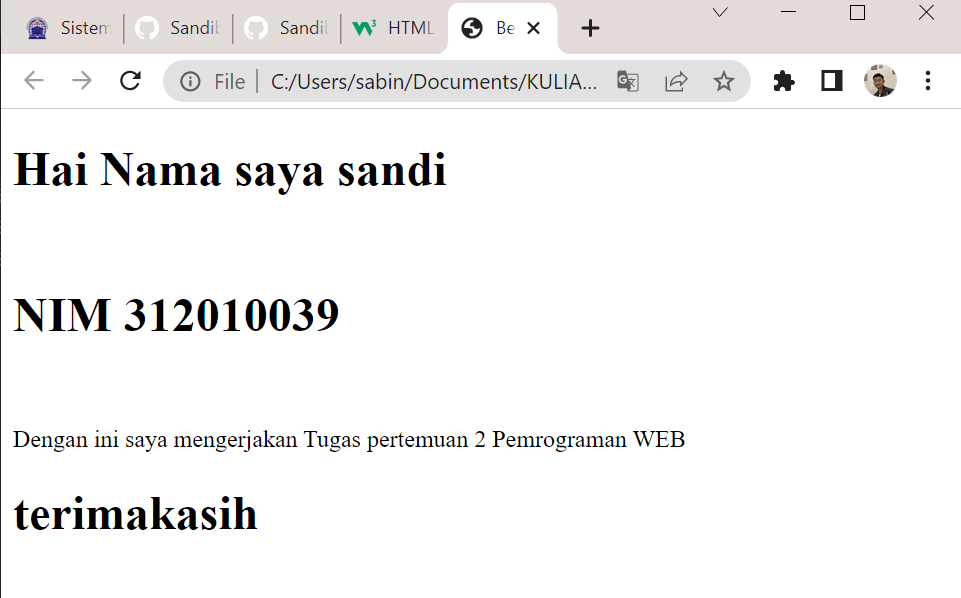
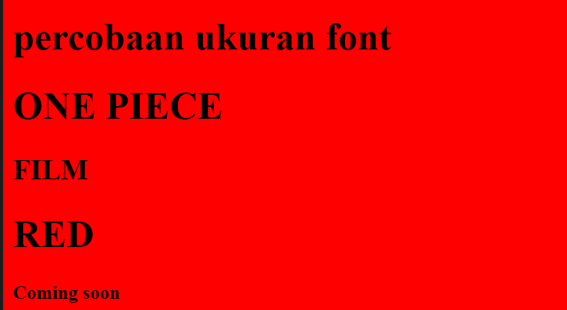

# Lab1web_
Tugas Pertemuan 2 Lab1Web
<br>
<h1>بِسْمِ اللهِ الرَّحْمٰنِ الرَّحِيْم<h1/>
<br>
<h2>sandi bintara<h2/>
<h2>312010039<h2/>
<h2>TI20B1<h2/>
<br>

# Tugas

<hr>
<br>

# HTML
```<!DOCTYPE html>
<html>
<head>
<title>Belajar HTML</title>
</head>
<body>
<h1>Hai Nama saya sandi</h1>
<br>
<h1>NIM 312010039</h1>
<br>
<p>Dengan ini saya mengerjakan Tugas pertemuan 2 Pemrograman WEB</p>
<h1>terimakasih<h1/>
</body>
</html>
```
<hr>
<br>

# Output
> berikut output dari HTML di Atas


# Penggunaan background dan Ukuran font
> Menggunakan Background merah dan ukuran font h1, h2, dan h3
```
<!DOCTYPE html>
<html>
<>
<head>
<title>Belajar HTML</title>
</head>
<body bgcolor = "red" >

<h1>percobaan ukuran font<h1/>
<h1>hai<h1/>
<h2>hai<h2/>
<h3>hai<h3/>

</body>
</html>
```
# Output background dan font
> Background merah dan font ukuran h1, h2, h3




